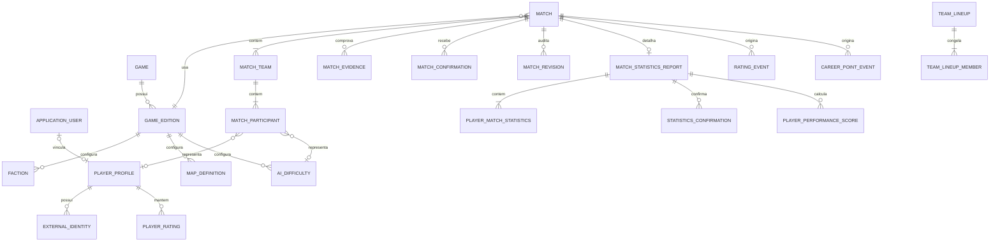

# Modelo conceitual

O diagrama registra entidades e relações planejadas. Nem todas fazem parte da primeira fatia.

- `Match` é a raiz do agregado; equipes e participantes não são alterados isoladamente.
- Um humano aponta para `PlayerProfile`, que pode ou não estar vinculado a uma conta.
- Uma IA aponta para dificuldade configurável e não é um usuário fictício.
- Resultado pertence à equipe. O formato (`3x2`) é derivado das quantidades de humanos.
- Rating e pontos são livros de eventos reconstruíveis e independentes.
- Relatórios pós-jogo preservam a origem dos dados e só geram bônus de carreira após confirmação e validação.
